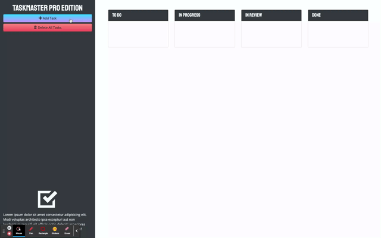

# Taskmaster Pro

A task organizer app. You can add a new task with a due date. You are able to drag and drop each task to "to do", "in progress", "in review", "done", and "delete." jQuery UI is used for the drag and drop. Moment.js is used to keep track of the time for each task. When a task is becoming within 2 dates due, a CSS class is added to the task to change the card. CSS Bootstrap is used for mobile responsive design.



## Table of Contents

|                                         |                                                               |                                                   |
| :-------------------------------------: | :-----------------------------------------------------------: | :-----------------------------------------------: |
|     [Introduction](#taskmaster-pro)     |            [Table of Contents](#table-of-contents)            | [Development Highlights](#development-highlights) |
|         [Deployment](#deployed)         | [Description of Page Building](#Description-of-Page-Building) |       [Code Hightlights](#code-highlights)        |
| [Technologies Used](#Technologies-Used) |                      [Credits](#Credits)                      |                [License](#License)                |

## Development Highlight

- Use jQuery as a JavaScript library for DOM traversals and manipulation
- Implement CSS Bootstrap grid layout
- Implement custom fonts and icons via CDNs
- Incorporate dynamic time for due dates through moment.js

## Deployment

[Deployment](https://anusontarangkul.github.io/taskmaster-pro/)

This app is deployed using GitHub pages.

## Description of Page Building

- .gitignore
- index.html
- LICENSE
- README
- assets
  - css
    - style.css
  - gif
    - gif
  - js
    - score.js

A basic file structure for this frontend web app.

## Code Highlights

Used moment.js to check if the due date for each task has a difference of less than 2 days. The CSS class is updated to change the color of the task.

```JavaScript
var auditTask = function (taskEl) {
  // get date from task element
  var date = $(taskEl).find("span").text().trim();

  // convert to moment object at 5:00pm
  var time = moment(date, "L").set("hour", 17);

  // remov any old classes from element
  $(taskEl).removeClass("list-group-item-warning list-group-item-danger");

  // apply new class if task is near/over due date
  if (moment().isAfter(time)) {
    $(taskEl).addClass("list-group-item-danger");
  } else if (Math.abs(moment().diff(time, "days")) <= 2) {
    $(taskEl).addClass("list-group-item-warning");
  }
};
```

Used jQuery UI sortable method for the drag and drop. Used "this" to identify which task to look at.

```JavaScript
$(".card .list-group").sortable({
  connectWith: $(".card .list-group"),
  scroll: false,
  tolerance: "pointer",
  helper: "clone",
  activate: function (event) {
    $(this).addClass("dropover");
    $(".bottom-trash").addClass("bottom-trash-drag");
  },
  deactivate: function (event) {
    $(this).removeClass("dropover");
    $(".bottom-trash").removeClass("bottom-trash-drag");
  },
  over: function (event) {
    $(this).addClass("dropover-active");
  },
  out: function (event) {
    $(this).removeClass("dropover-active");
  },
  update: function (event) {
    // array to store the task data in
    var tempArr = [];
    // loop over current set of children in sortable list
    $(this).children().each(function () {
      var text = $(this).find("p").text().trim();
      var date = $(this).find("span").text().trim();

      // add task data to the temp array as an object
      tempArr.push({
        text: text,
        date: date
      });
    });
    // trim down list's ID to match object property
    var arrName = $(this).attr("id").replace("list-", "")
    tasks[arrName] = tempArr;
    saveTasks();
  }
});
```

## Technologies Used

### Languages

- [HTML](https://www.w3schools.com/html/)
- [JavaScript](https://www.javascript.com/)
- [CSS](https://www.w3schools.com/css/)

### Design Libraries

- [Bootstrap](https://getbootstrap.com/)
- [Open-Iconic](https://useiconic.com/open)

### JavaScript Libraries

- [Moment.js](https://momentjs.com/)
- [jQuery](https://jquery.com/)]
- [jQueryUI](https://jqueryui.com/)
- [popper.js](https://popper.js.org/)

## Credits

|                           |                                                                                                                                                                                                       |
| ------------------------- | ----------------------------------------------------------------------------------------------------------------------------------------------------------------------------------------------------- |
| **David Anusontarangkul** | [ LinkedIn](https://www.linkedin.com/in/anusontarangkul/) [ GitHub](https://github.com/anusontarangkul) |

## License

[](https://opensource.org/licenses/MIT)
